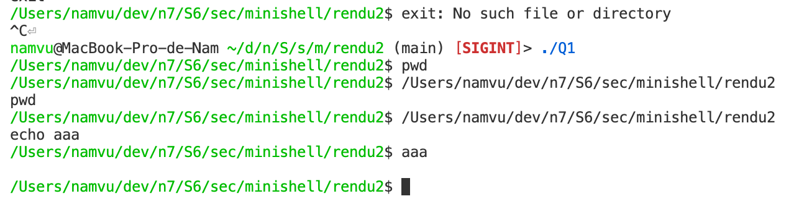

> VU Nam – 1SN-N \
> 21/05/2021

# Rendu final
## Conception
Le fichier `Q*.c` est composé de la boucle principale et des handlers. \
La liste des `jobs` et sa gestion sont définies par `process`. \
Les fonctions intégrées au shell sont définies par `builtin`.

Pour la compilation, le `Makefile` est inclus.

## Question 2

Vu que le père n'attends pas le fils, il finit par afficher le prompt avant la réponse du fils, d'ou un chevauchement sur la sortie standard...

## Questions 6 et 7
Je suis parti sur le scénario avec réinterprétation des signaux. \
Les `SIGSTP` sont transformés en `SIGSTOP` et les `SIGINT` en `SIGKILL`. \
`SIGSTP` et `SIGINT` sont masqués dans le fils.

## Questions 8, 9 et 10
Les redirections et les pipes fonctionnent avec les commandes externes *et internes*.

Exemple fonctionnel:
```
echo aaa > test
cat < test | tr a b | tr b c | tr c d > test2
cat test2
```
devrait retourner `ddd`

## Tests
Je n'ai pas vraiment traité la Q9 j'étais passé direct à la 10...

Pour Q1-Q7 j'ai fait mes tests essentiellement avec des `sleep`. \
Pour la Q8, des `echo` et `cat`. \
Sur les Q9-Q10 des `echo` et `tr`.
